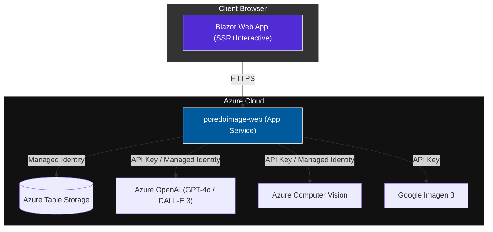
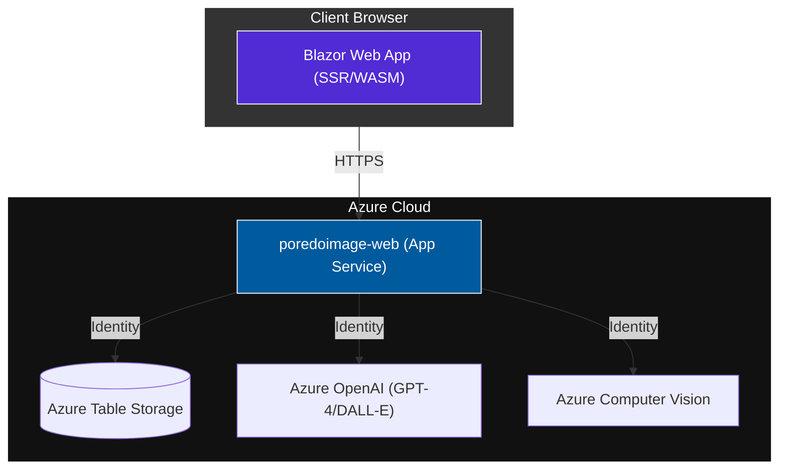

# PoRedoImage - AI-Powered Image Studio

A Blazor Web App that uses Azure AI to analyze, describe, and artistically transform your photos. Built on .NET 10 with Vertical Slice Architecture.

## 🗂️ Architecture



Detailed views: [Architecture](docs/Architecture.mmd) | [System Flow](docs/SystemFlow.mmd) | [Data Model](docs/DataModel.mmd)

## 📄 Documentation

- [Product Specification](docs/ProductSpec.md)
- [DevOps Guide](docs/DevOps.md)

## 🎯 Key Features

| Feature | Description |
|---------|-------------|
| Image Regeneration | Computer Vision + GPT-4o + DALL-E 3 |
| Meme Generation | Auto-caption with witty text overlay |
| Bulk Generate | 10 art-style variations via Google Imagen 3 |
| Auth | Dev: `/dev-login`; Prod: Microsoft Entra ID OIDC |
| Diagnostics | `/diag` page with masked config values |

## 🛠️ Tech Stack

- **Framework**: .NET 10 Blazor Web App (Interactive Server)
- **Infrastructure**: Azure Bicep + Managed Identity
- **Observability**: Serilog + OpenTelemetry → Application Insights
- **Testing**: xUnit (Unit + Integration) + Playwright (E2E)

## 🚀 Getting Started

### Prerequisites

- .NET 10.0 SDK
- Azure subscription with Computer Vision and OpenAI resources
- VS Code with C# Dev Kit

### 1. Clone and Restore

```bash
git clone https://github.com/punkouter26/PoRedoImage.git
cd PoRedoImage
dotnet restore PoRedoImage.slnx
```

### 2. Configure Secrets (local dev)

Use `dotnet user-secrets` or `appsettings.Development.json`:

```json
{
  "ComputerVision": {
    "Endpoint": "https://your-resource.cognitiveservices.azure.com/",
    "ApiKey": "your-key"
  },
  "OpenAI": {
    "Endpoint": "https://your-resource.openai.azure.com/",
    "Key": "your-key",
    "ChatCompletionsDeployment": "gpt-4o",
    "ImageGenerationDeployment": "dall-e-3"
  },
  "Google": {
    "ApiKey": "your-gemini-key"
  },
  "Storage": {
    "ConnectionString": "DefaultEndpointsProtocol=https;..."
  }
}
```

### 3. Run

```bash
dotnet run --project src/PoRedoImage.Web
# → http://localhost:5000  https://localhost:5001
```

### 4. Running Tests

```bash
# Unit + Integration
dotnet test PoRedoImage.slnx

# E2E (requires running app on :5000)
cd tests/PoRedoImage.Tests.E2E && npx playwright test
```

## 📡 API Endpoints

| Method | Path | Description |
|--------|------|-------------|
| GET | `/health` | Full health check (JSON) |
| GET | `/alive` | Liveness probe |
| GET | `/api/diag` | Masked config diagnostics |
| POST | `/api/images/analyze` | Analyze + process image |
| GET | `/api/bulk-generate/prompts` | Load saved art prompts |
| POST | `/api/bulk-generate/prompts` | Save art prompts |
| GET | `/scalar/v1` | Interactive API docs |

## 📁 Project Structure

```
src/
  PoRedoImage.Web/
    Features/
      Auth/           # OIDC + dev login
      BulkGenerate/   # Imagen 3 bulk generation, prompt storage
      Diagnostics/    # /diag endpoint, Key Vault mapping, middleware
      ImageAnalysis/  # Computer Vision, OpenAI, Meme Generator
      ImageSession/   # Per-circuit image state service
    Components/       # Blazor pages + shared components
    Models/           # DTOs
tests/
  PoRedoImage.Tests.Unit/        # xUnit, pure logic
  PoRedoImage.Tests.Integration/ # xUnit, WebApplicationFactory
  PoRedoImage.Tests.E2E/         # Playwright TypeScript
infra/
  main.bicep          # Azure App Service + Storage provisioning
```

## 🔧 Configuration Reference

All secrets load from Azure Key Vault in Production (via `AZURE_KEY_VAULT_ENDPOINT` env var).
Locally, use `dotnet user-secrets` or `appsettings.Development.json`.

Key Vault secret names use the `PoRedoImage-` prefix (see `KeyVaultSecretNameMapping.cs`).

## 📙 Dev Guidelines

See [.github/copilot-instructions.md](.github/copilot-instructions.md) for conventions:

- **Vertical Slice Architecture** — feature files live in `Features/{Name}/`
- **Minimal APIs** — no MVC controllers; use `MapGroup`
- **Central Package Management** — all versions in `Directory.Packages.props`
- **TreatWarningsAsErrors** — enforced in `Directory.Build.props`

## �️ Architecture Overview

The application follows a modern cloud-native architecture, utilizing Microsoft Azure for compute, storage, and AI processing.



Detailed architectural views:
- [System Architecture](docs/Architecture.mmd) | [Simple View](docs/Architecture_SIMPLE.mmd)
- [System Flow & User Journey](docs/SystemFlow.mmd) | [Simple View](docs/SystemFlow_SIMPLE.mmd)
- [Entity Data Model](docs/DataModel.mmd) | [Simple View](docs/DataModel_SIMPLE.mmd)

## 📄 Documentation Index

- [Product Specification (PRD & Metrics)](docs/ProductSpec.md)
- [DevOps Guide (Deployment & Onboarding)](docs/DevOps.md)

## 🎯 Key Capabilities
- 🔍 **Image Analysis**: Azure Computer Vision powered analysis
- 📝 **Enhanced Descriptions**: Azure OpenAI GPT-4 generated descriptions  
- 🎨 **Bulk Regeneration**: DALL-E powered image creation sets
- 📊 **Performance Metrics**: Real-time processing time tracking
- 🏥 **Health Monitoring**: Aspire-integrated health endpoints

## 🧪 Documentation Refactor: Blast Radius Assessment
The recent documentation consolidation merges multiple fragmented files into high-signal mermaid diagrams and PRD assets. This improves AI context utilization and human readability. No code logic was modified, ensuring zero impact on downstream service dependencies or runtime behavior.

## 🛠️ Technology Stack
- **Framework**: .NET 10.0 Unified Blazor
- **Orchestration**: .NET Aspire 9.3
- **Infrastructure**: Azure Bicep & Managed Identity
- **Observability**: OpenTelemetry / Application Insights
- **Testing**: xUnit / Playwright

## 🚀 Getting Started

### Prerequisites
- .NET 10.0 SDK (10.0.100+)
- Azure Subscription with Computer Vision and OpenAI services
- VS Code with C# Dev Kit extension

### Local Development

#### 1. Clone and Restore
```bash
git clone https://github.com/punkouter26/PoRedoImage.git
cd PoRedoImage
dotnet restore PoRedoImage.slnx
```

#### 2. Configure Secrets

Create or update `src/PoRedoImage.Web/appsettings.Development.json`:
```json
{
  "AzureOpenAI": {
    "ApiKey": "your-key",
    "Endpoint": "https://your-resource.openai.azure.com/",
    "DeploymentName": "gpt-4",
    "DalleDeploymentName": "dall-e-3"
  },
  "ComputerVision": {
    "Key": "your-key",
    "Endpoint": "https://your-resource.cognitiveservices.azure.com/"
  }
}
```

#### 3. Run the Application

**Option A: Direct (Web only)**
```bash
cd src/PoRedoImage.Web
dotnet run
```

**Option B: With Aspire AppHost**
```bash
cd src/PoRedoImage.AppHost
dotnet run
```

**Option C: VS Code F5**
- Select "Launch Web (Direct)" or "Launch AppHost (Aspire)"

### Running Tests

```bash
# All tests
dotnet test PoRedoImage.slnx

# Unit tests only
dotnet test tests/PoRedoImage.Tests.Unit

# Integration tests only
dotnet test tests/PoRedoImage.Tests.Integration

# With coverage
dotnet test PoRedoImage.slnx --collect:"XPlat Code Coverage"
```

## 📡 API Endpoints

### Health Checks (Aspire Defaults)
- `GET /health` - Full health check
- `GET /alive` - Liveness probe

### Image Analysis (Minimal API)
- `GET /api/images/status` - Service status
- `POST /api/images/analyze` - Analyze image

### Documentation
- `GET /openapi/v1.json` - OpenAPI spec
- `GET /scalar/v1` - Interactive API docs

## 📁 Project Structure

| Project | Purpose |
|---------|---------|
| `PoRedoImage.Web` | Main Blazor Web App, hosts API and UI |
| `PoRedoImage.Web.Client` | WASM client for interactive components |
| `PoRedoImage.AppHost` | Aspire orchestration host |
| `PoRedoImage.ServiceDefaults` | Shared Aspire config (OpenTelemetry, health) |
| `PoRedoImage.Shared` | DTOs shared between Web and Client |
| `PoRedoImage.Tests.Unit` | Unit tests with xUnit |
| `PoRedoImage.Tests.Integration` | Integration tests with WebApplicationFactory |

## 🔧 Configuration

### Environment Variables
- `ASPNETCORE_ENVIRONMENT` - Development/Production
- `AZURE_KEY_VAULT_ENDPOINT` - Key Vault URI (Production)

### appsettings.json Structure
```json
{
  "Logging": { ... },
  "AzureOpenAI": {
    "ApiKey": "",
    "Endpoint": "",
    "DeploymentName": "gpt-4",
    "DalleDeploymentName": "dall-e-3"
  },
  "ComputerVision": {
    "Key": "",
    "Endpoint": ""
  },
  "ApplicationInsights": {
    "ConnectionString": ""
  }
}
```

## 📝 Development Guidelines

Following [copilot-instructions.md](.github/copilot-instructions.md):

- **Vertical Slice Architecture** - Features in `/Features/{FeatureName}/`
- **Minimal APIs** - No controllers, use `MapGroup`
- **Central Package Management** - All versions in Directory.Packages.props
- **Test Naming** - `MethodName_StateUnderTest_ExpectedBehavior`
- **TDD Workflow** - Red → Green → Refactor
- **80% Code Coverage** - Target for business logic

## 📄 License

MIT License - See LICENSE file for details.
