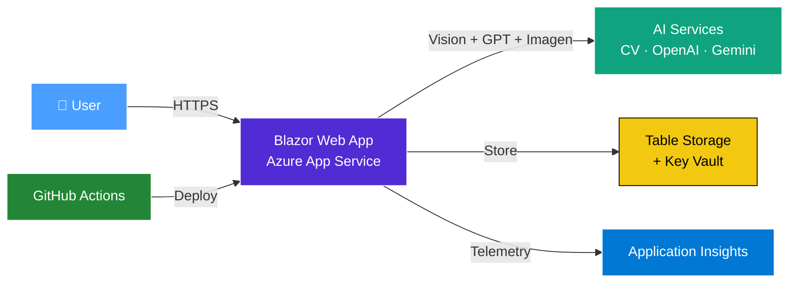

# PoRedoImage — AI-Powered Image Studio

A .NET 10 Blazor Web App that uses **Azure Computer Vision**, **Azure OpenAI GPT-4.1-nano**, and **Google Gemini** to analyze, describe, and artistically transform photos. Built with Vertical Slice Architecture, deployed to Azure App Service via GitHub Actions OIDC.

**Live:** https://poredoimage-web.azurewebsites.net | **API Docs:** `/scalar/v1` | **Health:** `/health`

---

## Architecture Overview


```mermaid
flowchart LR
    User["👤 User"] -->|"HTTPS"| App["Blazor Web App\nAzure App Service"]
    App -->|"Vision + GPT + Imagen"| AI["AI Services\nCV · OpenAI · Gemini"]
    App -->|"Store"| Data["Table Storage\n+ Key Vault"]
    App -->|"Telemetry"| Ops["Application Insights"]
    CI["GitHub Actions"] -->|"Deploy"| App

    style User fill:#4a9eff,stroke:#fff,color:#fff
    style App fill:#512bd4,stroke:#fff,color:#fff
    style AI fill:#10a37f,stroke:#fff,color:#fff
    style Data fill:#f2c811,stroke:#000,color:#000
    style Ops fill:#0078d4,stroke:#fff,color:#fff
    style CI fill:#238636,stroke:#fff,color:#fff
```

---

## Key Features

| Feature | Description |
|---------|-------------|
| Image Analysis | Computer Vision → GPT-4.1-nano enhancement → tags + confidence |
| Image Regeneration | Gemini `gemini-2.5-flash-image` with reference bytes |
| Meme Generation | SkiaSharp text overlay on analysed image |
| Bulk Generate | 10 art-style variations via parallel Gemini calls, streamed live |
| Auth | Dev: `/dev-login` cookie · Prod: Microsoft Entra ID OIDC |
| Diagnostics | `/diag` masked config · `/health` · `/scalar/v1` API docs |

---

## Tech Stack

| Layer | Technology |
|-------|-----------|
| Framework | .NET 10 Blazor Web App (SSR + Interactive Server) |
| AI — Vision | Azure Computer Vision `cv-poshared-eastus` |
| AI — Language | Azure OpenAI GPT-4.1-nano `openai-poshared-eastus` |
| AI — Image Gen | Google Gemini `gemini-2.5-flash-image` |
| Storage | Azure Table Storage `stporedoimage26` |
| Secrets | Azure Key Vault `kv-poshared` (Access Policy + 30 min rotation) |
| Observability | OpenTelemetry + Serilog → Application Insights |
| Infrastructure | Azure Bicep + GitHub Actions OIDC |
| Testing | xUnit · Testcontainers · Playwright TypeScript |

---

## Documentation

### Master Diagrams
| Diagram | Description | Simplified |
|---------|-------------|------------|
| [Architecture_MASTER.mmd](docs/Architecture_MASTER.mmd) | C4 L1+L2 — Edge, Compute, Data, AI, Ops subgraphs | [SIMPLE](docs/Architecture_MASTER_SIMPLE.mmd) |
| [DataLifecycle_MASTER.mmd](docs/DataLifecycle_MASTER.mmd) | Ingestion → Processing → Egress pipeline | [SIMPLE](docs/DataLifecycle_MASTER_SIMPLE.mmd) |
| [DataModel.mmd](docs/DataModel.mmd) | ERD — USER · BULK_PROMPT · IMAGE_RESULT + state enum | [SIMPLE](docs/DataModel_SIMPLE.mmd) |
| [SystemFlow_MASTER.mmd](docs/SystemFlow_MASTER.mmd) | Auth flow + Image Analysis + Bulk Generate sequence | [SIMPLE](docs/SystemFlow_MASTER_SIMPLE.mmd) |
| [MultiplayerFlow.mmd](docs/MultiplayerFlow.mmd) | Parallel bulk generation — slot concurrency + conflict resolution | [SIMPLE](docs/MultiplayerFlow_SIMPLE.mmd) |

Screenshots: [docs/screenshots/](docs/screenshots/)

---

## Getting Started

### Prerequisites
- .NET 10 SDK
- Azure subscription with Computer Vision + OpenAI resources

### 1. Clone and restore
```bash
git clone https://github.com/punkouter26/PoRedoImage.git
cd PoRedoImage
dotnet restore PoRedoImage.slnx
```

### 2. Configure secrets (local)
```bash
dotnet user-secrets set "ComputerVision:ApiKey" "your-key" --project src/PoRedoImage.Web
dotnet user-secrets set "ComputerVision:Endpoint" "https://eastus.api.cognitive.microsoft.com/" --project src/PoRedoImage.Web
dotnet user-secrets set "OpenAI:Key" "your-key" --project src/PoRedoImage.Web
dotnet user-secrets set "OpenAI:Endpoint" "https://your-resource.openai.azure.com/" --project src/PoRedoImage.Web
dotnet user-secrets set "OpenAI:ChatCompletionsDeployment" "gpt-4.1-nano" --project src/PoRedoImage.Web
dotnet user-secrets set "Google:ApiKey" "your-gemini-key" --project src/PoRedoImage.Web
dotnet user-secrets set "Google:Imagen3Model" "gemini-2.5-flash-image" --project src/PoRedoImage.Web
dotnet user-secrets set "Storage:ConnectionString" "your-connection-string" --project src/PoRedoImage.Web
```

### 3. Run
```bash
dotnet run --project src/PoRedoImage.Web
# → http://localhost:5000  |  https://localhost:5001
# Dev login: http://localhost:5000/dev-login?email=you@example.com
```

### 4. Test
```bash
dotnet test PoRedoImage.slnx                                    # Unit + Integration
cd tests/PoRedoImage.Tests.E2E && npx playwright test           # E2E
```

---

## API Endpoints

| Method | Path | Description |
|--------|------|-------------|
| GET | `/health` | Full health check (JSON) |
| GET | `/alive` | Liveness probe |
| GET | `/diag` | Masked config diagnostics |
| POST | `/api/images/analyze` | Analyze + process image |
| GET | `/api/bulk-generate/prompts` | Load saved art prompts |
| POST | `/api/bulk-generate/prompts` | Save art prompts |
| GET | `/scalar/v1` | Interactive API docs |

---

## Project Structure
```
src/PoRedoImage.Web/
  Features/
    Auth/             # OIDC + dev login cookie handler
    BulkGenerate/     # Imagen3Service, parallel generation, prompt storage
    Diagnostics/      # /diag endpoint, KeyVaultSecretNameMapping, middleware
    ImageAnalysis/    # ComputerVisionService, OpenAIService, MemeGeneratorService
    ImageSession/     # Per-circuit image state service
  Components/         # Blazor pages + shared layout
  Models/             # DTOs and enums
tests/
  PoRedoImage.Tests.Unit/            # xUnit pure logic
  PoRedoImage.Tests.Integration/     # xUnit + WebApplicationFactory + Testcontainers
  PoRedoImage.Tests.E2E/             # Playwright TypeScript
infra/
  main.bicep          # App Service + Storage provisioning
docs/                 # All .mmd diagrams + screenshots
```

---

## Key Vault Secrets (Production)

All secrets load from `kv-poshared` via `AZURE_KEY_VAULT_ENDPOINT` app setting.

| Key Vault Secret | Config Key |
|-----------------|------------|
| `PoRedoImage-ComputerVision-ApiKey` | `ComputerVision:ApiKey` |
| `PoRedoImage-ComputerVision-Endpoint` | `ComputerVision:Endpoint` |
| `PoRedoImage-OpenAI-ApiKey` | `OpenAI:Key` |
| `PoRedoImage-OpenAI-Endpoint` | `OpenAI:Endpoint` |
| `PoRedoImage-OpenAI-DeploymentName` | `OpenAI:ChatCompletionsDeployment` |
| `PoRedoImage-StorageConnectionString` | `Storage:ConnectionString` |
| `PoRedoImage-Google-ApiKey` | `Google:ApiKey` |
| `PoRedoImage-Google-Imagen3Model` | `Google:Imagen3Model` |
| `PoRedoImage-ApplicationInsights-ConnectionString` | `ApplicationInsights:ConnectionString` |

---

## Dev Guidelines

See [.github/copilot-instructions.md](.github/copilot-instructions.md):
- **Vertical Slice Architecture** — all feature files in `Features/{Name}/`
- **Minimal APIs** — no MVC controllers; use `MapGroup` + static handler methods
- **Nullable + warnings as errors** enforced via `Directory.Build.props`
- **Prefix**: `PoRedoImage` for all namespaces and Azure resources
