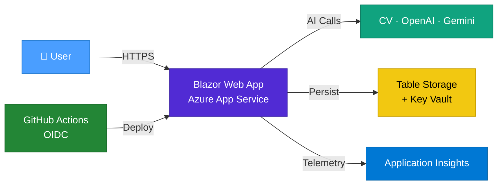

# PoRedoImage — AI-Powered Image Studio

> **Product Requirements Document (PRD) · v2.0 · April 2026**

---
  ...
## Product Vision

PoRedoImage is a cloud-native AI image studio that transforms ordinary photos into artistic masterpieces, memes, and stylistic variations in seconds. By chaining Azure Computer Vision, Azure OpenAI GPT-4.1-nano, and Google Gemini Imagen3 behind a clean Blazor Web App, PoRedoImage makes professional-grade AI image manipulation accessible to anyone — no prompt engineering required.

The core user promise: *upload a photo, choose a style, get a gallery-worthy result in under 10 seconds.*

---

## Product Requirements

### Goals
1. **Instant AI Transformation** — Users can upload any JPEG/PNG and receive an AI-regenerated image or a captioned meme within one interaction.
2. **Bulk Art Studio** — Power users can generate 10 distinct art-style variations of a photo in a single click, with results streaming live as each slot completes.
3. **Personal Gallery** — Every result can be saved to a persistent per-user gallery backed by Azure Table Storage, accessible across sessions.
4. **Zero-friction Auth** — Development environment uses a one-click cookie login; production uses Microsoft Entra ID OIDC with no additional friction for M365 users.
5. **Observable & Reliable** — Every AI call is traced via OpenTelemetry and logged via Serilog to Application Insights; a `/health` endpoint verifies all dependencies at runtime.

### Non-Goals (v1)
- Native mobile app (responsive web only)
- Video processing
- Real-time collaborative editing
- Custom model fine-tuning UI

### User Personas
| Persona | Core Need | Primary Flow |
|---------|-----------|--------------|
| **Creative** — social media creator | Unique art variations for posts | Bulk Generate × 10 styles |
| **Casual** — personal user | Fun meme from a photo | Meme Generation mode |
| **Developer** — API consumer | Integration testing + diagnostics | `/diag` + `/scalar/v1` + `/health` |

### Key Metrics (Success Criteria)
| Metric | Target |
|--------|--------|
| End-to-end image regeneration latency | < 10 s p95 |
| Bulk generate (10 variations) wall-clock | < 45 s p95 |
| CI test coverage gate | ≥ 80% (opencover) |
| Production deployment success rate | ≥ 99% (OIDC zero-secret deploy) |
| `/health` uptime SLA | 99.5% |

---

## Architecture Overview


```mermaid
flowchart LR
    User["👤 User"] -->|"HTTPS"| App["Blazor Web App\nAzure App Service"]
    App -->|"AI Calls"| AI["CV · OpenAI · Gemini"]
    App -->|"Persist"| Data["Table Storage\n+ Key Vault"]
    App -->|"Telemetry"| Ops["Application Insights"]
    CI["GitHub Actions\nOIDC"] -->|"Deploy"| App

    style User fill:#4a9eff,stroke:#2a7fd4,color:#fff
    style App fill:#512bd4,stroke:#3a1fa8,color:#fff
    style AI fill:#10a37f,stroke:#0a7a5f,color:#fff
    style Data fill:#f2c811,stroke:#c9a000,color:#000
    style Ops fill:#0078d4,stroke:#005fa3,color:#fff
    style CI fill:#238636,stroke:#196228,color:#fff
```

**Live:** https://poredoimage-web.azurewebsites.net | **API Docs:** `/scalar/v1` | **Health:** `/health`

---

## Key Features

| Feature | Description |
|---------|-------------|
| Image Analysis | Computer Vision → GPT-4.1-nano enhancement → tags + confidence |
| Image Regeneration | Gemini `gemini-2.5-flash-image` with reference bytes |
| Meme Generation | SkiaSharp text overlay on analysed image |
| Bulk Generate | 10 art-style variations via parallel Gemini calls, streamed live |
| Auth | Dev: `/dev-login` cookie · Prod: Microsoft Entra ID OIDC |
| Diagnostics | `/diag` masked config · `/health` · `/scalar/v1` API docs |

---

## Tech Stack

| Layer | Technology |
|-------|-----------|
| Framework | .NET 10 Blazor Web App (SSR + Interactive Server) |
| AI — Vision | Azure Computer Vision `cv-poshared-eastus` |
| AI — Language | Azure OpenAI GPT-4.1-nano `openai-poshared-eastus` |
| AI — Image Gen | Google Gemini `gemini-2.5-flash-image` |
| Storage | Azure Table Storage `stporedoimage26` |
| Secrets | Azure Key Vault `kv-poshared` (Access Policy + 30 min rotation) |
| Observability | OpenTelemetry + Serilog → Application Insights |
| Infrastructure | Azure Bicep + GitHub Actions OIDC |
| Testing | xUnit · Testcontainers · Playwright TypeScript |

---

## Documentation

### Architecture & CI/CD
| Diagram | Description |
|---------|-------------|
| [Architecture_MASTER.mmd](docs/Architecture_MASTER.mmd) | Hybrid C4 L1+L2 — Edge, Compute, Application, AI, Data, Ops, CI/CD |
| [Architecture_MASTER_SIMPLE.mmd](docs/Architecture_MASTER_SIMPLE.mmd) | Stakeholder overview — 6-node summary |
| [ReleasePipeline_MASTER.mmd](docs/ReleasePipeline_MASTER.mmd) | CI/CD — PR gate → CI → master → Azure deploy with smoke check |
| [ReleasePipeline_MASTER_SIMPLE.mmd](docs/ReleasePipeline_MASTER_SIMPLE.mmd) | Pipeline summary — 5 nodes |

### User Usage & Behavioral Flowcharts
| Diagram | Description |
|---------|-------------|
| [OnboardingJourney.mmd](docs/OnboardingJourney.mmd) | New user → login → first upload → Aha! moment |
| [OnboardingJourney_SIMPLE.mmd](docs/OnboardingJourney_SIMPLE.mmd) | Stakeholder onboarding summary |
| [PrimaryValueFlow.mmd](docs/PrimaryValueFlow.mmd) | Happy path: Bulk Generate — upload → describe → 10×parallel → live stream |
| [PrimaryValueFlow_SIMPLE.mmd](docs/PrimaryValueFlow_SIMPLE.mmd) | 6-step value flow |
| [ExceptionUserFlows.mmd](docs/ExceptionUserFlows.mmd) | Auth errors, validation failures, rate limits, content policy, AI outages |
| [ExceptionUserFlows_SIMPLE.mmd](docs/ExceptionUserFlows_SIMPLE.mmd) | Error taxonomy overview |

### Logic & State Dynamics
| Diagram | Description |
|---------|-------------|
| [SystemFlow_MASTER.mmd](docs/SystemFlow_MASTER.mmd) | Full sequence — Key Vault startup · auth · image pipeline · bulk generate |
| [SystemFlow_MASTER_SIMPLE.mmd](docs/SystemFlow_MASTER_SIMPLE.mmd) | 8-step sequence summary |
| [StateDynamics_MASTER.mmd](docs/StateDynamics_MASTER.mmd) | stateDiagram-v2 — UserImage, BulkVariation, BulkPrompt lifecycles |
| [StateDynamics_MASTER_SIMPLE.mmd](docs/StateDynamics_MASTER_SIMPLE.mmd) | Core image state machine |

### Data & Security Schema
| Diagram | Description |
|---------|-------------|
| [DataModel.mmd](docs/DataModel.mmd) | ERD — USER · USER_IMAGE · BULK_PROMPT + enums |
| [DataModel_SIMPLE.mmd](docs/DataModel_SIMPLE.mmd) | Entity summary |
| [AccessControl_MATRIX.mmd](docs/AccessControl_MATRIX.mmd) | Role → endpoint mapping: Anonymous · Dev · Prod · Admin |
| [AccessControl_MATRIX_SIMPLE.mmd](docs/AccessControl_MATRIX_SIMPLE.mmd) | Access tier overview |
| [DataLifecycle_MASTER.mmd](docs/DataLifecycle_MASTER.mmd) | Ingestion → magic-byte validate → CV → OpenAI → Gemini → Blazor render → persist |
| [DataLifecycle_MASTER_SIMPLE.mmd](docs/DataLifecycle_MASTER_SIMPLE.mmd) | 7-step data pipeline |

### Dependency & UI Hierarchy
| Diagram | Description |
|---------|-------------|
| [SystemInteractionFlow.mmd](docs/SystemInteractionFlow.mmd) | Sequence — Blazor SignalR · parallel bulk slots · state sync · conflict resolution |
| [SystemInteractionFlow_SIMPLE.mmd](docs/SystemInteractionFlow_SIMPLE.mmd) | 8-message interaction summary |
| [ServiceMap_MASTER.mmd](docs/ServiceMap_MASTER.mmd) | Full project dependency graph — VSA slices · Application · Domain · Infra · Shared |
| [ServiceMap_MASTER_SIMPLE.mmd](docs/ServiceMap_MASTER_SIMPLE.mmd) | 6-layer dependency summary |
| [InterfaceHierarchy_MASTER.mmd](docs/InterfaceHierarchy_MASTER.mmd) | Frontend component tree — App → Layout → SSR → WASM → UI components → state |
| [InterfaceHierarchy_MASTER_SIMPLE.mmd](docs/InterfaceHierarchy_MASTER_SIMPLE.mmd) | Component hierarchy overview |

---

## Getting Started

### Prerequisites
- .NET 10 SDK
- Azure subscription with Computer Vision + OpenAI resources

### 1. Clone and restore
```bash
git clone https://github.com/punkouter26/PoRedoImage.git
cd PoRedoImage
dotnet restore PoRedoImage.slnx
```

### 2. Configure secrets (local)
```bash
dotnet user-secrets set "ComputerVision:ApiKey" "your-key" --project src/PoRedoImage.Web
dotnet user-secrets set "ComputerVision:Endpoint" "https://eastus.api.cognitive.microsoft.com/" --project src/PoRedoImage.Web
dotnet user-secrets set "OpenAI:Key" "your-key" --project src/PoRedoImage.Web
dotnet user-secrets set "OpenAI:Endpoint" "https://your-resource.openai.azure.com/" --project src/PoRedoImage.Web
dotnet user-secrets set "OpenAI:ChatCompletionsDeployment" "gpt-4.1-nano" --project src/PoRedoImage.Web
dotnet user-secrets set "Google:ApiKey" "your-gemini-key" --project src/PoRedoImage.Web
dotnet user-secrets set "Google:Imagen3Model" "gemini-2.5-flash-image" --project src/PoRedoImage.Web
dotnet user-secrets set "Storage:ConnectionString" "your-connection-string" --project src/PoRedoImage.Web
```

### 3. Run
```bash
dotnet run --project src/PoRedoImage.Web
# → http://localhost:5000  |  https://localhost:5001
# Dev login: http://localhost:5000/dev-login?email=you@example.com
```

### 4. Test
```bash
dotnet test PoRedoImage.slnx                                    # Unit + Integration
cd tests/PoRedoImage.Tests.E2E && npx playwright test           # E2E
```

---

## API Endpoints

| Method | Path | Description |
|--------|------|-------------|
| GET | `/health` | Full health check (JSON) |
| GET | `/alive` | Liveness probe |
| GET | `/diag` | Masked config diagnostics |
| POST | `/api/images/analyze` | Analyze + process image |
| GET | `/api/bulk-generate/prompts` | Load saved art prompts |
| POST | `/api/bulk-generate/prompts` | Save art prompts |
| GET | `/scalar/v1` | Interactive API docs |

---

## Project Structure
```
src/PoRedoImage.Web/
  Features/
    Auth/             # OIDC + dev login cookie handler
    BulkGenerate/     # Imagen3Service, parallel generation, prompt storage
    Diagnostics/      # /diag endpoint, middleware
    ImageAnalysis/    # ComputerVisionService, OpenAIService, MemeGeneratorService
  Components/         # Blazor pages + shared layout (incl. ImageSessionService)
  Configuration/      # KeyVaultSecretNameMapping
  Models/             # DefaultPrompts
tests/
  PoRedoImage.Tests.Unit/            # xUnit pure logic
  PoRedoImage.Tests.Integration/     # xUnit + WebApplicationFactory + Testcontainers
  PoRedoImage.Tests.E2E/             # Playwright TypeScript
infra/
  main.bicep          # App Service + Storage provisioning
docs/                 # All .mmd diagrams + screenshots
```

---

## Key Vault Secrets (Production)

All secrets load from `kv-poshared` via `AZURE_KEY_VAULT_ENDPOINT` app setting.

| Key Vault Secret | Config Key |
|-----------------|------------|
| `PoRedoImage-ComputerVision-ApiKey` | `ComputerVision:ApiKey` |
| `PoRedoImage-ComputerVision-Endpoint` | `ComputerVision:Endpoint` |
| `PoRedoImage-OpenAI-ApiKey` | `OpenAI:Key` |
| `PoRedoImage-OpenAI-Endpoint` | `OpenAI:Endpoint` |
| `PoRedoImage-OpenAI-DeploymentName` | `OpenAI:ChatCompletionsDeployment` |
| `PoRedoImage-StorageConnectionString` | `Storage:ConnectionString` |
| `PoRedoImage-Google-ApiKey` | `Google:ApiKey` |
| `PoRedoImage-Google-Imagen3Model` | `Google:Imagen3Model` |
| `PoRedoImage-ApplicationInsights-ConnectionString` | `ApplicationInsights:ConnectionString` |

---

## Dev Guidelines

See [.github/copilot-instructions.md](.github/copilot-instructions.md):
- **Vertical Slice Architecture** — all feature files in `Features/{Name}/`
- **Minimal APIs** — no MVC controllers; use `MapGroup` + static handler methods
- **Nullable + warnings as errors** enforced via `Directory.Build.props`
- **Prefix**: `PoRedoImage` for all namespaces and Azure resources
