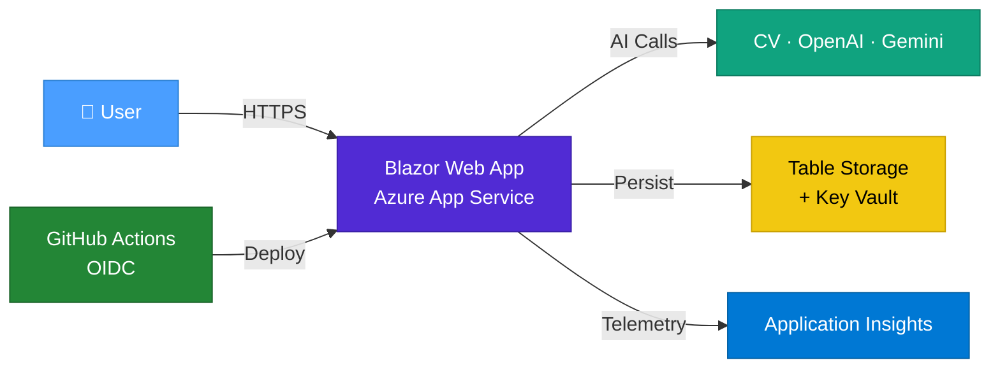

# PoRedoImage — AI-Powered Image Studio

> **Product Requirements Document (PRD) · v2.0 · April 2026**

---
  ...
## Product Vision

PoRedoImage is a cloud-native AI image studio that transforms ordinary photos into artistic masterpieces, memes, and stylistic variations in seconds. By chaining Azure Computer Vision, Azure OpenAI GPT-4.1-nano, and Google Gemini Imagen3 behind a clean Blazor Web App, PoRedoImage makes professional-grade AI image manipulation accessible to anyone — no prompt engineering required.

The core user promise: *upload a photo, choose a style, get a gallery-worthy result in under 10 seconds.*

---

## Product Requirements

### Goals
1. **Instant AI Transformation** — Users can upload any JPEG/PNG and receive an AI-regenerated image or a captioned meme within one interaction.
2. **Bulk Art Studio** — Power users can generate 10 distinct art-style variations of a photo in a single click, with results streaming live as each slot completes.
3. **Personal Gallery** — Every result can be saved to a persistent per-user gallery backed by Azure Table Storage, accessible across sessions.
4. **Zero-friction Auth** — Development environment uses a one-click cookie login; production uses Microsoft Entra ID OIDC with no additional friction for M365 users.
5. **Observable & Reliable** — Every AI call is traced via OpenTelemetry and logged via Serilog to Application Insights; a `/health` endpoint verifies all dependencies at runtime.

### Non-Goals (v1)
- Native mobile app (responsive web only)
- Video processing
- Real-time collaborative editing
- Custom model fine-tuning UI

### User Personas
| Persona | Core Need | Primary Flow |
|---------|-----------|--------------|
| **Creative** — social media creator | Unique art variations for posts | Bulk Generate × 10 styles |
| **Casual** — personal user | Fun meme from a photo | Meme Generation mode |
| **Developer** — API consumer | Integration testing + diagnostics | `/diag` + `/scalar/v1` + `/health` |

### Key Metrics (Success Criteria)
| Metric | Target |
|--------|--------|
| End-to-end image regeneration latency | < 10 s p95 |
| Bulk generate (10 variations) wall-clock | < 45 s p95 |
| CI test coverage gate | ≥ 80% (opencover) |
| Production deployment success rate | ≥ 99% (OIDC zero-secret deploy) |
| `/health` uptime SLA | 99.5% |

---

## Architecture Overview


```mermaid
flowchart LR
    User["👤 User"] -->|"HTTPS"| App["Blazor Web App\nAzure App Service"]
    App -->|"AI Calls"| AI["CV · OpenAI · Gemini"]
    App -->|"Persist"| Data["Table Storage\n+ Key Vault"]
    App -->|"Telemetry"| Ops["Application Insights"]
    CI["GitHub Actions\nOIDC"] -->|"Deploy"| App

    style User fill:#4a9eff,stroke:#2a7fd4,color:#fff
    style App fill:#512bd4,stroke:#3a1fa8,color:#fff
    style AI fill:#10a37f,stroke:#0a7a5f,color:#fff
    style Data fill:#f2c811,stroke:#c9a000,color:#000
    style Ops fill:#0078d4,stroke:#005fa3,color:#fff
    style CI fill:#238636,stroke:#196228,color:#fff
```

**Live:** https://poredoimage-web.azurewebsites.net | **API Docs:** `/scalar/v1` | **Health:** `/health`

---

## Key Features

| Feature | Description |
|---------|-------------|
| Image Analysis | Computer Vision → GPT-4.1-nano enhancement → tags + confidence |
| Image Regeneration | Gemini `gemini-2.5-flash-image` with reference bytes |
| Meme Generation | SkiaSharp text overlay on analysed image |
| Bulk Generate | 10 art-style variations via parallel Gemini calls, streamed live |
| Auth | Dev: `/dev-login` cookie · Prod: Microsoft Entra ID OIDC |
| Diagnostics | `/diag` masked config · `/health` · `/scalar/v1` API docs |

---

## Tech Stack

| Layer | Technology |
|-------|-----------|
| Framework | .NET 10 Blazor Web App (global Interactive WebAssembly, no prerender) behind an ASP.NET Core BFF |
| AI — Vision | Azure Computer Vision `cv-poshared-eastus` |
| AI — Language | Azure OpenAI GPT-4.1-nano `openai-poshared-eastus` |
| AI — Image Gen | Google Gemini `gemini-2.5-flash-image` |
| Storage | Azure Table Storage `stporedoimage26` |
| Secrets | Azure Key Vault `kv-poshared` (Access Policy + 30 min rotation) |
| Observability | OpenTelemetry + Serilog → Application Insights |
| Infrastructure | Azure Bicep + GitHub Actions OIDC |
| Testing | xUnit · Testcontainers · C# Playwright (Unit · Integration · E2EAPI · E2EUI) — not run in CI |

---

## Documentation

### Architecture

Live Mermaid diagrams live alongside their source in [`docs/`](docs/). See [docs/README.md](docs/README.md) for the full index of architecture, journey, state, data, and UI diagrams.

---

## Getting Started

### Prerequisites
- .NET 10 SDK
- Azure subscription with Computer Vision + OpenAI resources

### 1. Clone and restore
```bash
git clone https://github.com/punkouter26/PoRedoImage.git
cd PoRedoImage
dotnet restore PoRedoImage.slnx
```

### 2. Configure secrets (local)

There is no local secret store to populate — `dotnet user-secrets` is deliberately **not** used
(the project has no `UserSecretsId`). Local runs read the same Azure Key Vault the deployed app
does, through `DefaultAzureCredential`. Sign in once and the host picks the secrets up on start:

```bash
az login          # the signed-in identity needs "Key Vault Secrets User" on kv-poshared
dotnet run --project src/PoRedoImage.Web
```

`AddPoRedoImageKeyVault` loads `KeyVault:Uri` (`https://kv-poshared.vault.azure.net/`) and
`StartupSecretValidator` fails the host fast, naming any secret it could not resolve. To work
without Key Vault access — no AI calls, no storage — run against the mocks instead:

```bash
Mocks__UseMockAi=true Storage__ConnectionString="" dotnet run --project src/PoRedoImage.Web
```

### 3. Run
```bash
dotnet run --project src/PoRedoImage.Web
# → http://localhost:4000  |  https://localhost:4001
# Dev login: http://localhost:4000/dev-login?email=you@example.com
```

### 4. Test
```bash
dotnet test PoRedoImage.slnx                                    # Unit + Integration
dotnet test tests/PoRedoImage.Tests.E2E                          # E2E (C# Playwright + HTTP smoke)
```

---

## API Endpoints

| Method | Path | Description |
|--------|------|-------------|
| GET | `/health` | Full health check (JSON) |
| GET | `/alive` | Liveness probe |
| GET | `/diag` | Masked config diagnostics |
| POST | `/api/images/analyze` | Analyze + process image |
| GET | `/api/bulk-generate/prompts` | Load saved art prompts |
| POST | `/api/bulk-generate/prompts` | Save art prompts |
| GET | `/scalar/v1` | Interactive API docs |

---

## Project Structure
```
src/PoRedoImage.Web/        # API/BFF host
  Features/
    Auth/             # OIDC + dev login cookie handler, /auth + /api auth
    BulkGenerate/     # Imagen3Service, parallel generation, prompt storage endpoints
    Diagnostics/      # /api/diag endpoint, middleware
    ImageAnalysis/    # ComputerVisionService, OpenAIService, MemeGeneratorService
  Components/         # App.razor host document + _Imports (renders the Client's <Routes> as WASM)
  Configuration/      # KeyVaultSecretNameMapping
src/PoRedoImage.Client/     # Blazor WASM SPA
  Routes.razor        # Router (global InteractiveWebAssembly)
  Pages/ Layout/ Shared/ Models/   # all interactive UI + ImageSessionService
  wwwroot/            # static assets (the only wwwroot in the solution)
tests/
  PoRedoImage.Tests.Unit/            # xUnit pure logic
  PoRedoImage.Tests.Integration/     # xUnit + WebApplicationFactory + Testcontainers
  PoRedoImage.Tests.E2EAPI/          # pure HTTP API E2E (xUnit, self-skip if no live instance)
  PoRedoImage.Tests.E2EUI/           # C# Playwright UI E2E (self-skip if no live instance)
infra/
  main.bicep          # App Service + Storage provisioning
docs/                 # All .mmd diagrams + screenshots
```

---

## Key Vault Secrets (Production)

All secrets load from `kv-poshared` via `AZURE_KEY_VAULT_ENDPOINT` app setting.

| Key Vault Secret | Config Key |
|-----------------|------------|
| `PoRedoImage-ComputerVision-ApiKey` | `ComputerVision:ApiKey` |
| `PoRedoImage-ComputerVision-Endpoint` | `ComputerVision:Endpoint` |
| `PoRedoImage-OpenAI-ApiKey` | `OpenAI:Key` |
| `PoRedoImage-OpenAI-Endpoint` | `OpenAI:Endpoint` |
| `PoRedoImage-OpenAI-DeploymentName` | `OpenAI:ChatCompletionsDeployment` |
| `PoRedoImage-StorageConnectionString` | `Storage:ConnectionString` |
| `PoRedoImage-Google-ApiKey` | `Google:ApiKey` |
| `PoRedoImage-Google-Imagen3Model` | `Google:Imagen3Model` |
| `PoRedoImage-ApplicationInsights-ConnectionString` | `ApplicationInsights:ConnectionString` |

---

## Dev Guidelines

- **Vertical Slice Architecture** — all feature files in `Features/{Name}/`
- **Minimal APIs** — no MVC controllers; use `MapGroup` + static handler methods
- **Nullable + warnings as errors** enforced via `Directory.Build.props`
- **Prefix**: `PoRedoImage` for all namespaces and Azure resources
