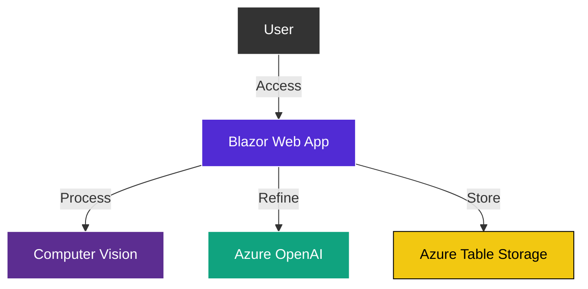

# Product Specification: PoRedoImage

## 🎯 PRD & Success Metrics

**Vision**: A streamlined image exploration platform that leverages high-fidelity AI to analyze, describe, and transform visual content.

### Business Logic & "Why"
PoRedoImage exists to demonstrate rapid visual iteration through AI. By combining Computer Vision with Generative AI, we provide a unified pipeline that bridges the gap between raw pixels and generated creative concepts.

### Key Feature Definitions
- **Image Analysis**: Automatic extraction of descriptive metadata using Azure Computer Vision.
- **Enhanced Descriptions**: GPT-4 refinement of raw vision data into high-signal natural language.
- **Bulk Image Generation**: Multi-threaded prompt execution via DALL-E to generate visual sets from user inputs.
- **Integrated Auth**: Seamless transition between local development (/dev-login) and cloud production (Entra ID).

### Success Metrics
- **Performance**: Average processing time per image under 5 seconds.
- **Reliability**: 99.9% success rate for AI service availability through unified health checks.
- **Token Efficiency**: Minimized GPT-4 prompt overhead through optimized vertical slice engineering.

## 🏗️ Architecture Overview

