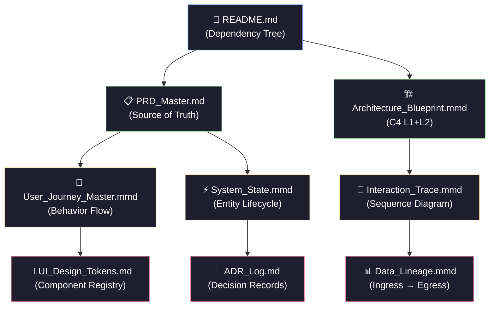

# PoRedoImage — Documentation Index

> Machine-Readable, Human-Glanceable documentation suite for .NET 10 / C# 14 / Zero-Waste AI.

## Dependency Tree



## Documentation Tiers

| Tier | File | Purpose | Audience |
|------|------|---------|----------|
| **0** | [README.md](README.md) | This index — dependency graph + navigation | Everyone |
| **1** | [PRD_Master.md](PRD_Master.md) | Source of Truth — API contracts, slices, constraints | Architects, AI Agents |
| **1** | [Architecture_Blueprint.mmd](Architecture_Blueprint.mmd) | C4 L1+L2 — MSI Dev Machine vs. Azure Container Apps | Architects, DevOps |
| **2** | [User_Journey_Master.mmd](User_Journey_Master.mmd) | Identity, success path, error handling flows | Product, UX |
| **2** | [System_State.mmd](System_State.mmd) | Entity lifecycle state machines with guards | Backend Devs |
| **2** | [Interaction_Trace.mmd](Interaction_Trace.mmd) | Blazor WASM → API → Table Storage sequence | Backend Devs |
| **3** | [UI_Design_Tokens.md](UI_Design_Tokens.md) | Radzen component settings, CSS vars, layout rules | Frontend Devs |
| **3** | [ADR_Log.md](ADR_Log.md) | Architecture Decision Records — why, not just what | Architects |
| **3** | [Data_Lineage.mmd](Data_Lineage.mmd) | Data flow from ingress through transformation to UI | Data Engineers |

## Quick Start

```bash
# Convert all Mermaid diagrams to SVG
Get-ChildItem docs\*.mmd | ForEach-Object {
    mmdc -i $_.FullName -o "$($_.DirectoryName)\$($_.BaseName).svg" -t dark
}
```

## Architecture at a Glance

```
PoRedoImage = Blazor Web App (.NET 10)
  ├── Vertical Slice Features (Minimal API)
  │   ├── Auth (OIDC + Dev Cookie)
  │   ├── ImageAnalysis (CV → OpenAI → Gemini)
  │   ├── BulkGenerate (10× parallel Gemini)
  │   ├── CaptionBattle (8-persona parallel)
  │   ├── MemeTemplates (Normalized coords)
  │   └── StyleDirector (4-agent sequential)
  ├── Domain Layer (Entities + Interfaces)
  ├── Application Layer (Orchestrators + Agents)
  ├── Infrastructure Layer (Azure Services)
  └── Shared Layer (DTOs)